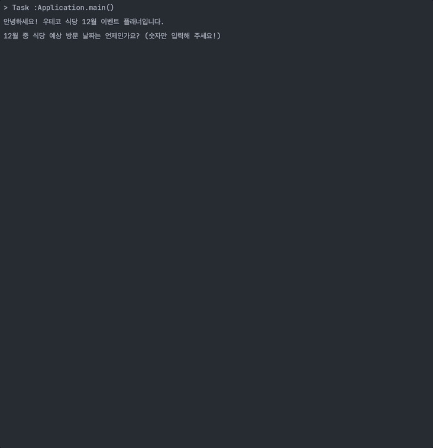

<p align="center">
    
</p>

# 프리코스 4주차 미션 - 크리스마스 프로모션

- - -


> 우아한테크코스 6기 4주차 미션, 크리스마스 프로모션을 구현한 저장소입니다.

<p align="center">
    
</p>

## 📚 목차

- [📝 기능 목록](#📝-기능-목록)
    - [식당 예상 방문 날짜 입력](#식당-예상-방문-날짜-입력)
    - [주문할 메뉴와 개수 입력](#주문할-메뉴와-개수-입력)
    - [프로모션 별 혜택 적용](#프로모션-별-혜택-적용)
        - [크리스마스 디데이 할인 정책](#크리스마스-디데이-할인-정책)
        - [평일 할인 정책](#평일-할인-정책)
        - [주말 할인 정책](#주말-할인-정책)
        - [특별 할인 정책](#특별-할인-정책)
        - [증정 이벤트 정책](#증정-이벤트-정책)
    - [적용된 모든 프로모션 혜택 정리](#적용된-모든-프로모션-혜택-정리)
    - [주문 내역 및 받을 수 있는 프로모션 혜택 출력](#주문-내역-및-받을-수-있는-프로모션-혜택-출력)
- [✅ 구현 현황](#-✅-구현-현황)

## 📝 기능 목록

- - -

### 식당 예상 방문 날짜 입력

사용자로부터 식당 예상 방문 날짜를 입력받습니다.

- `12월 중 식당 예상 방문 날짜는 언제인가요? (숫자만 입력해 주세요!)` 입력 메시지가 콘솔에 출력됩니다.
- 사용자로부터 날짜를 입력받습니다.
- 입력값 허용 조건은 다음과 같습니다.
    - `1 ~ 31` 범위 내 정수
- 조건에 맞지 않는 값이 입력되는 경우 다음과 같이 조치합니다.
    - `IllegalArgumentException`을 발생시킵니다.
    - `[ERROR] 유효하지 않은 날짜입니다. 다시 입력해 주세요.` 메시지를 사용자에게 출력하고 재입력받습니다.

```
안녕하세요! 우테코 식당 12월 이벤트 플래너입니다.
12월 중 식당 예상 방문 날짜는 언제인가요? (숫자만 입력해 주세요!)
3
```

### 주문할 메뉴와 개수 입력

사용자로부터 주문 메뉴와 개수를 입력받습니다.

- `주문하실 메뉴를 메뉴와 개수를 알려 주세요. (e.g. 해산물파스타-2,레드와인-1,초코케이크-1)` 입력 메시지가 콘솔에 출력됩니다.
- 사용자로부터 메뉴 명과 개수를 입력받습니다.
- 입력값 허용 조건은 다음과 같습니다.
    - `{메뉴 명}-{메뉴 개수}` 형식을 지킨 문자열
    - 여러개의 주문 메뉴는 띄워쓰기 없이 `,`로 구분
        - ex) `시저샐러드-1,티본스테이크-1`
    - 메뉴 중복 주문 불가능
        - ex) `시저샐러드-1,티본스테이크-1,시저샐러드-2`
    - 음료 메뉴만 주문 불가능
    - 총 주문 메뉴 개수는 `1 ~ 20` 범위 내
        - ex) `시저샐러드-1,티본스테이크-1,크리스마스파스타-1,제로콜라-3,아이스크림-1`의 총개수는 `7개`
    - `메뉴 명`은 메뉴판에 존재하는 메뉴 명
    - `메뉴 개수`는 `1 ~ 20` 범위 내 정수
- 조건에 맞지 않는 값이 입력되는 경우 다음과 같이 조치합니다.
    - `IllegalArgumentException`을 발생시킵니다.
    - `[ERROR] 유효하지 않은 주문입니다. 다시 입력해 주세요.` 메시지를 사용자에게 출력하고 재입력받습니다.

```
주문하실 메뉴를 메뉴와 개수를 알려 주세요. (e.g. 해산물파스타-2,레드와인-1,초코케이크-1)
티본스테이크-1,바비큐립-1,초코케이크-2,제로콜라-1
```

### 프로모션 별 혜택 적용

사용자로부터 받은 주문에 진행중인 프로모션 별 혜택을 적용해서 결과를 반환합니다.

- 모든 프로모션은 중복 적용이 가능합니다.
- 모든 프로모션은 총주문 금액 10,000원 이상부터 적용할 수 있습니다.

#### 크리스마스 디데이 할인 정책 적용

- 적용 가능 날짜는 `2023.12.1 ~ 2023.12.25`입니다.
- 총주문 금액에서 1,000원으로 시작하여 크리스마스가 다가올수록 날마다 100원씩 증가한 할인 금액이 적용됩니다..
    - ex) 시작일인 12월 1일에 1,000원, 2일에 1,100원, ..., 25일엔 3,400원

#### 평일 할인 정책 적용

- 적용 가능 날짜는 `2023.12.1 ~ 2023.12.31` 기간 중 `일요일 ~ 목요일`입니다.
- 디저트 메뉴를 메뉴 1개당 2,023원 할인 금액이 적용 됩니다.

#### 주말 할인 정책 적용

- 적용 가능 날짜는 `2023.12.1 ~ 2023.12.31` 기간 중 `금요일, 토요일`입니다.
- 메인 메뉴를 메뉴 1개당 2,023원 할인 금액이 적용 됩니다.

#### 특별 할인 정책 적용

- 적용 가능 날짜는 `2023년 12월` 중 `3, 10, 17, 24, 25, 31`일 입니다.
- 총주문 금액에서 1,000원 할인 금액이 적용 됩니다.

#### 증정 이벤트 정책 적용

- 적용 가능 날짜는 `2023.12.1 ~ 2023.12.31`입니다.
- 할인 전 총주문 금액이 12만 원 이상일 때, 샴페인 1개가 증정됩니다.

### 적용된 모든 프로모션 혜택 정리

적용된 모든 프로모션의 혜택을 정리합니다.

- 할인 전 총주문 금액
- 증정 메뉴
- 혜택 내역
- 총혜택 금액
    - 총혜택 금액 = 할인 금액의 합계 + 증정 메뉴의 가격
- 할인 후 예상 결제 금액
    - 할인 후 예상 결제 금액 = 할인 전 총주문 금액 - 할인 금액
- 12월 이벤트 배지
    - 총혜택 금액에 따른 이벤트 베지를 부여합니다.
    - 5천 원 이상: 별
    - 1만 원 이상: 트리
    - 2만 원 이상: 산타

### 주문 내역 및 받을 수 있는 프로모션 혜택 출력

사용자의 주문 내역과 받을 수 있는 프로모션 혜택 내역을 콘솔에 출력합니다.

- `12월 {사용자가-입력한-주문-일}일에 우테코 식당에서 받을 이벤트 혜택 미리 보기!` 안내 메시지를 먼저 출력합니다.
- 사용자의 주문 메뉴와 개수를 출력합니다.
- 출력할 혜택 내역은 다음과 같습니다.
    - 할인 전 총주문 금액
    - 증정 메뉴
        - 증정 메뉴가 없다면 `없음`으로 출력합니다.
    - 혜택 내역
        - 혜택 내역이 없다면 `없음`으로 출력합니다.
    - 총혜택 금액
        - 총혜택 금액이 없다면 `0원`으로 출력합니다.
    - 할인 후 예상 결제 금액
    - 12월 이벤트 배지
        - 12월 이벤트 배지가 없다면 `없음`으로 출력합니다.

```
12월 3일에 우테코 식당에서 받을 이벤트 혜택 미리 보기!

<주문 메뉴>
티본스테이크 1개
바비큐립 1개
초코케이크 2개
제로콜라 1개

<할인 전 총주문 금액>
142,000원
 
<증정 메뉴>
샴페인 1개
 
<혜택 내역>
크리스마스 디데이 할인: -1,200원
평일 할인: -4,046원
특별 할인: -1,000원
증정 이벤트: -25,000원
 
<총혜택 금액>
-31,246원
 
<할인 후 예상 결제 금액>
135,754원
 
<12월 이벤트 배지>
산타
```

## ✅ 구현 현황

- - -

- [X] 식당 예상 방문 날짜 입력 기능
- [X] 주문할 메뉴와 개수 입력 기능
- [X] 프로모션 별 혜택 적용 기능
    - [X] 크리스마스 디데이 할인 정책 적용 기능
    - [X] 평일 할인 정책 적용 기능
    - [X] 주말 할인 정책 적용 기능
    - [X] 특별 할인 정책 적용 기능
    - [X] 증정 이벤트 정책 적용 기능
- [X] 적용된 모든 프로모션 혜택 정리 기능
- [X] 주문 내역 및 받을 수 있는 프로모션 혜택 출력
